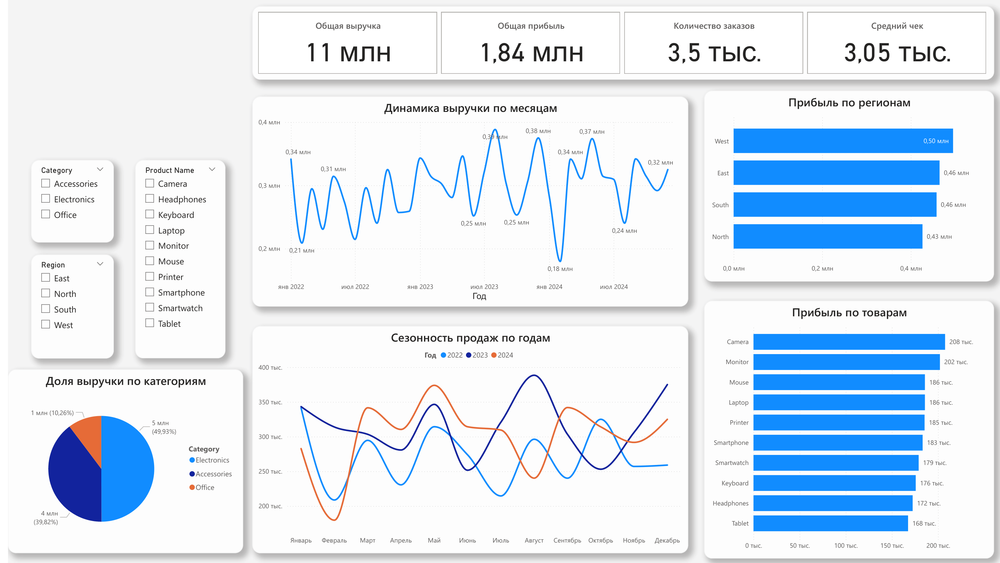

# E-commerce Sales Analysis

## Задача
Анализ продаж интернет-магазина с целью выявления факторов роста выручки и прибыли.

## Данные
3500 заказов с 7 характеристиками: дата, товар, категория, регион, 
количество, выручка, прибыль.

## Инструменты
- Python, Pandas — обработка данных
- SQL (SQLite) — анализ и запросы
- Matplotlib, Seaborn — визуализация в ноутбуке
- Power BI — финальный дашборд

## Ключевые выводы
- West — самый прибыльный регион (495k), North отстаёт: средний чек ~2900 против ~3167
- Camera и Monitor — лидеры по прибыли
- Tablet имеет сопоставимое количество заказов (~350), но приносит меньше прибыли → проблема маржи
- Маржинальность категорий стабильна (~17%) → структура продаж сбалансирована
- В феврале наблюдается спад продаж на 25–30%
- В каждом регионе свой лидер:
- West, North — Monitor
- South — Camera
- East — Smartphone

## Рекомендации
- Запустить акции в феврале для сглаживания сезонного спада
- Повышать средний чек в North
- Пересмотреть ценообразование Tablet

## Что демонстрирует проект
- SQL-аналитику (агрегации, группировки, метрики)
- Python для обработки данных
- Визуализацию и сторителлинг в Power BI
- Умение находить инсайты и давать бизнес-рекомендации

## Файлы
- `analysis.ipynb` — весь код и анализ с выводами
- `dashboard.pdf` — дашборд в Power BI

## Дашборд
